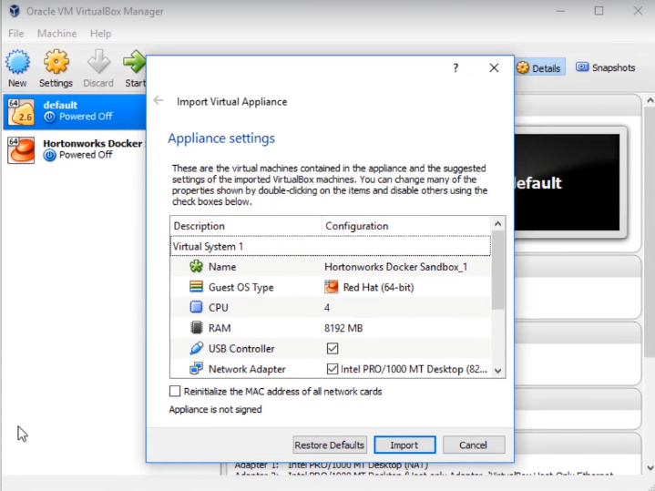
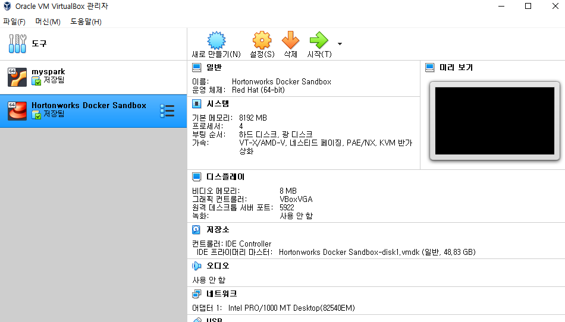
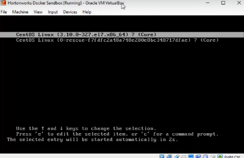
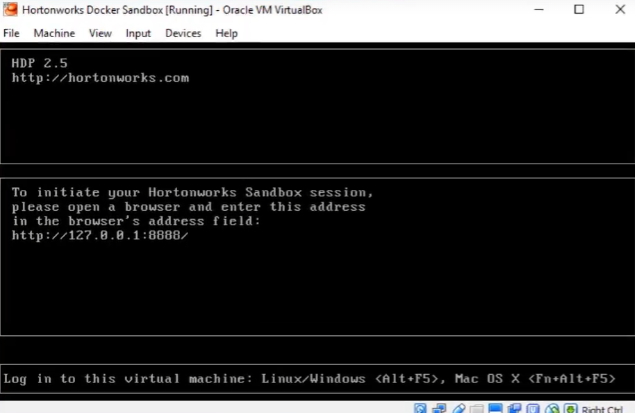
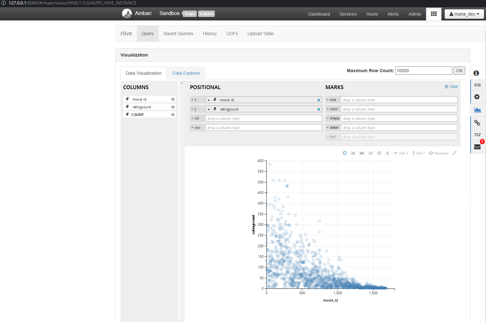

# VirtualBox를 통한 가상 서버 만들기

## Hadoop Stack 설치

1. 가상 머신 설치

   - [VirtualBox](www.virtualbox.org )
   - www.virtualbox.org 접속하여  Window hosts 다운로드
2. Hortonworks Data Platform
   - [HDP](https://archive.cloudera.com/hwx-sandbox/hdp/hdp-2.5.0/HDP_2.5_virtualbox.ova )
   - https://archive.cloudera.com/hwx-sandbox/hdp/hdp-2.5.0/HDP_2.5_virtualbox.ova 다운로드


[사진]

- HDP 설치 후 더블클릭 

  


- Import

  

  ​

- 위에 Hortonworks Docker Sandbox 더블 클릭

  - 부팅

    

  - 완료

    


3. 127.0.0.1:8888 접속 후 로그인

   

   ID/PW = maria_dev

   ​


4. Hive 접속해서 파일 import 후 쿼리를 통한 시각화
- 각각 movie_id별 평점 개수 
```
select movie_id, count(movie_id) as ratingCount
from ratings
group by movie_id
order by ratingcount
desc; 
```

   