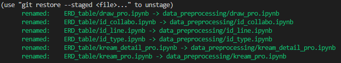

## git push 한 데이터 폴더이름 변경하기
=> 변경하고자 하는 상위폴더(.git) 있는 곳으로 옮기기
```git mv oldname newname ```
=> 폴더명 변경

``` git status ```
=> rename 확인


#test



```git commit -m 'rename'```
=> 변경된 메시지 기록하기


``` git psuh origin main ```
=> 다시 git 올리기


=> 전처리 데이터 폴더명을 ERD_table로 잘못 저장한 후 git에 올려서 폴더명을 data_preprocessing로 변경한 작업

* 추가적으로 ERD_table 폴더 다시 만들어서 mysql에 Datawarehouse 구축을 위한 자료 push함

8/29 ```git my oldname newname ``` -> 오타수정 my-> mv