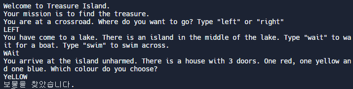

## 3일차

##### 홀짝 알려주기

```
if number % 2 ==0:
  print("This is an even number")
else:
  print("This is an odd number")
```


##### 윤년 구하기

```
if year % 4 == 0:
	if year % 100 == 0:
		if year % 400 == 0:
			print('윤년이다.')
		else:
			print('윤년이 아니다.')
	else:
		print('윤년이다.')
else:
	print("윤년이 아니다.")
```


##### 피자 주문하기

- 내 코드

```
print("Welcome to Python Pizza Deliveries!")
size = input("What size pizza do you want? S, M, or L ")
add_pepperoni = input("Do you want pepperoni? Y or N ")
extra_cheese = input("Do you want extra cheese? Y or N ")

if size == 'S':
    bill = 15

if size == 'M':
    bill = 20
   
if size == 'L':
    bill = 25
    
# 오류    
# if add_pepperoni == "Y":
#   if size == "S":
#       bill = bill + 2
#   if size == "M" and size == "L":
#       bill = bill + 3
# else :
#   bill = bill

if add_pepperoni == "Y" and size == "S":
    bill = bill + 2
if add_pepperoni == "Y" and size == "M":
    bill = bill + 3
if add_pepperoni == "Y" and size == "L":
    bill = bill + 3

if extra_cheese == "Y":
    bill = bill + 1
    print(f'최종 {bill}달러입니다.')
else:
    print(f'최종 {bill}달러입니다.')
```

- 강사 코드

  ```
  print("Welcome to Python Pizza Deliveries!")
  size = input("What size pizza do you want? S, M, or L ")
  add_pepperoni = input("Do you want pepperoni? Y or N ")
  extra_cheese = input("Do you want extra cheese? Y or N ")

  bill = 0

  if size == 'S':
      bill += 15

  if size == 'M':
      bill += 20
     
  if size == 'L':
      bill += 25
      
  if add_pepperoni == "Y":
  	if size == "S"
  		bill +=2
      else:
      	bill +=3
      	
  if extra_cheese == "Y":
      bill += 1
  print(f'최종 {bill}달러입니다.')
  ```


- 놓쳤던 부분
  - print를 마지막 if문에 넣어주어서  add_pepperoni에 대한 처리가 되지 않아 코드를 통한 계산오류


- 아쉬운 부분
  - bill = bill +3 과 같은 표현을 bill +=3으로 가독성 좋게 표현할 것


##### 사랑지수 테스트기

- 내 코드

  ```
  # 🚨 Don't change the code below 👇
  print("Welcome to the Love Calculator!")
  name1 = input("What is your name? \n")
  name2 = input("What is their name? \n")
  # 🚨 Don't change the code above 👆

  #Write your code below this line 👇
  name = (name1 + name2).lower()

  T = name.count("t")
  R = name.count("r")
  U = name.count("u")
  E = name.count("e")
  true_sum= T + R + U + E
  # print(f"{true_sum}")

  L = name.count("l")
  O = name.count("o")
  V = name.count("v")
  E = name.count("e")
  love_sum = L + O + V+ E
  love_scores = str(true_sum)+ str(love_sum)
  love_scores= int(love_scores)

  if love_scores < 10 or love_scores > 90:
    print (f"점수는 {love_scores}이고 상극 또는 찰떡입니다.")
  elif love_scores > 40 and love_scores < 50 :
    print (f"점수는 {love_scores}이고 잘 어울리시네요.")
  else:
    print (f"점수는 {love_scores}입니다.")
  ```

  ​

  ##### 보물섬 찾기 프로젝트

  - 내 코드

  ```
  print('''
  *******************************************************************************
            |                   |                  |                     |
   _________|________________.=""_;=.______________|_____________________|_______
  |                   |  ,-"_,=""     `"=.|                  |
  |___________________|__"=._o`"-._        `"=.______________|___________________
            |                `"=._o`"=._      _`"=._                     |
   _________|_____________________:=._o "=._."_.-="'"=.__________________|_______
  |                   |    __.--" , ; `"=._o." ,-"""-._ ".   |
  |___________________|_._"  ,. .` ` `` ,  `"-._"-._   ". '__|___________________
            |           |o`"=._` , "` `; .". ,  "-._"-._; ;              |
   _________|___________| ;`-.o`"=._; ." ` '`."\` . "-._ /_______________|_______
  |                   | |o;    `"-.o`"=._``  '` " ,__.--o;   |
  |___________________|_| ;     (#) `-.o `"=.`_.--"_o.-; ;___|___________________
  ____/______/______/___|o;._    "      `".o|o_.--"    ;o;____/______/______/____
  /______/______/______/_"=._o--._        ; | ;        ; ;/______/______/______/_
  ____/______/______/______/__"=._o--._   ;o|o;     _._;o;____/______/______/____
  /______/______/______/______/____"=._o._; | ;_.--"o.--"_/______/______/______/_
  ____/______/______/______/______/_____"=.o|o_.--""___/______/______/______/____
  /______/______/______/______/______/______/______/______/______/______/_____ /
  *******************************************************************************
  ''')
  print("Welcome to Treasure Island.")
  print("Your mission is to find the treasure.") 

  #Write your code below this line 👇
  answer = input(print('You are at a crossroad. Where do you want to go? Type "left" or "right"\n'))
  answer_lower= answer.lower()
  if answer_lower == "right":
    print('게임 오버')
  else:
    action= input(print('You have come to a lake. There is an island in the middle of the lake. Type "wait" to wait for a boat. Type "swim" to swim across.'))
    action_lower = action.lower()
    if action_lower == "swim":
      print('게임 오버')
    elif action_lower == 'wait':
      color=input(print("You arrive at the island unharmed. There is a house with 3 doors. One red, one yellow and one blue. Which colour do you choose?"))
      color_lower = color.lower()
      if color_lower == "yellow":
        print("보물을 찾았습니다.")
      elif color_lower == 'blue':
        print('게임 오버')
      elif color_lower == 'Red':
        print('게임 오버')
  ```

  - 강사 코드

    ```
    answer = input('You\'re at a crossroad. Where do you want to go? Type "left" or "right"\n')
    answer_lower= answer.lower()
    if answer_lower == "right":
      print('게임 오버')
    ```

    

    ​

  - 놓쳤던 부분

    - input(print())으로 하여 코드 작동 시 None 값 출력이 나온다.

      ==> **print 제외하고 input()**으로 수정하면 None 값 출력 안나온다.

  - 알게된 부분

    - 문자열 작성 시 \ 는 뒤에 따옴표 무시할 수 있다. you're를 you are로 바꾸는 것도 방법!

  ​

  ​