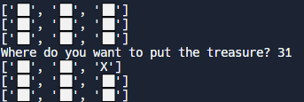

## 4일차

##### 보물 지도

- 내 코드

  ```
  row1 = ["⬜️","⬜️","⬜️"]
  row2 = ["⬜️","⬜️","⬜️"]
  row3 = ["⬜️","⬜️","⬜️"]
  map = [row1, row2, row3]
  print(f"{row1}\n{row2}\n{row3}")
  position = input("Where do you want to put the treasure? ")
  ```

  ```
  # 해결하지 못함
  xy= position
  map[x-1][y-1] = X # 좋은 방법
  ```

  ​

- 강사 코드

  ```
  ex)23
  horizonal=int(position[0]) #"2"
  vertical = int(position[1]) #"3"

  selected_row=map[vertical-1]
  selected_row[horizonal-1]="X"

  print(f"{row1}\n{row2}\n{row3}")
  ```

  

  - 놓쳤던 부분
    - 리스트 인덱스를 활용하여 각각의 변수로 작성하지 못한것.
    - 행과 열 -1을 해주는 것까지는 캐치를 하였고 리스트의 이해를 하고 있기에 한번에 X를 지정해주는 것은 좋은방법


##### 가위 바위 보

- 문제

  ```
  rock = '''
      _______
  ---'   ____)
        (_____)
        (_____)
        (____)
  ---.__(___)
  '''

  paper = '''
      _______
  ---'   ____)____
            ______)
            _______)
           _______)
  ---.__________)
  '''

  scissors = '''
      _______
  ---'   ____)____
            ______)
         __________)
        (____)
  ---.__(___)
  '''
  import random
  #Write your code below this line 👇

  ```

  ​

-  내 코드

  ```
  my_choice = int(input("바위는 0, 보는 1, 가위는 2이야 무엇을 고를래?\n"))
  if my_choice == 0 or my_choice > 2:
    print("작성 오류로 패배")
  else:
    if my_choice == 0:
      print(rock)
    if my_choice == 1:
      print(paper)
    if my_choice == 2:
      print(scissors)

    computer_choice = random.randint(0, 2)
    print("computer_choice:")
    if computer_choice == 0:
      print(rock)
    if computer_choice == 1:
      print(paper)
    if computer_choice == 2:
      print(scissors)
    
    if my_choice == 0 and computer_choice == 1:
      print("패배")
    elif my_choice == 0 and computer_choice == 2:
      print("승리")
    elif my_choice == 0 and computer_choice == 0:
      print("비김")
    
    if my_choice == 1 and computer_choice == 1:
      print("비김")
    if my_choice == 1 and computer_choice == 2:
      print("패배")
    if my_choice == 1 and computer_choice == 0:
      print("승리")
    
    if my_choice == 2 and computer_choice == 1:
      print("승리")
    if my_choice == 2 and computer_choice == 2:
      print("비김")
    if my_choice == 2 and computer_choice == 0:
      print("패배")
  ```

  ​

- 강사 코드

  ```
  game_images = [rock, paper, scissors]

  user_choice = int(input("What do you choose? Type 0 for Rock, 1 for Paper or 2 for Scissors.\n"))
  print(game_images[user_choice])

  computer_choice = random.randint(0, 2)
  print("Computer chose:")
  print(game_images[computer_choice])

  if user_choice >= 3 or user_choice < 0: 
    print("You typed an invalid number, you lose!") 
  elif user_choice == 0 and computer_choice == 2:
    print("You win!")
  elif computer_choice == 0 and user_choice == 2:
    print("You lose")
  elif computer_choice > user_choice:
    print("You lose")
  elif user_choice > computer_choice:
    print("You win!")
  elif computer_choice == user_choice:
    print("It's a draw")
  ```

  - 개선해야 할 점

    - 로직을 구성하는데 if문만 사용해도 문제없지만 list의 index 를 활용한다면 더 좋은 코드 가능

    - 예외처리에 대한 부분 놓침(잘못된 값을 넣을 경우에 대한 대책 마련x )

      ​

##### 3의 배수, 5의 배수, 15의 배수 구하기

- 내 코드

  ```
  number_lst=[]
  for number in range(1,101):
    if number % 3 == 0:
      number="Fizz"
      number_lst += number
    elif number % 5 == 0:
      number="Buzz"
      number_lst += number
    elif number % 3 == 0 and number % 15 == 0:
      number="FizzBuzz"
      number_lst += number
    else:
      number_lst.append(number)

  print(number_lst)
  ```

  ​

- 강사 코드

  ```
  for number in range(1,101):
  	if number % 3 == 0 and number % 15 == 0:
        print("FizzBuzz")
      elif if number % 3 == 0:
        print("Fizz")
      elif number % 5 == 0:
        print("Buzz")
      else:
        print(number)
  ```

  - 개선해야 할 점

    - 프로그램 로직 상 3의 배수나 5의 배수를 먼저 작성하게 되면 15의 배수가 진행되지 않는다.

      ==> 15의 배수부터 작성 훙 3의 배수 5의 배수로 작성 해야한다.

    - 단순히 print를 활용하면되는데 너무 복잡하게 list를 사용하다보니 해결하지 못했다.

      ==> 너무 한 방향에만 빠져있지 말고 다른 방법에 관해서도 생각 해야겠다.