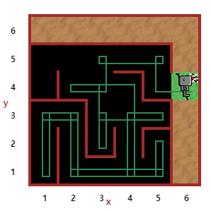

## 6일차-While

##### 미로 탈출

- 내 코드

  ```
  def turn_right():
      turn_left()
      turn_left()
      turn_left()
      
  while not at_goal():
      if right_is_clear():   
          turn_right()
          move()
      elif front_is_clear():
           move()
      elif wall_in_front():
           turn_right()
           move()
  # 실패
  ```

  ​

- 강사 코드

  ```
  # 오른쪽 돌기 함수 만들기
  def turn_right():
      turn_left()
      turn_left()
      turn_left()

  # 앞에 벽이 없을 때 (특별한 케이스에 오류로 인해 추가 작성)
  while front_is_clear():
      move()
  turn_left()
      
  # 미로 찾기    
  while not at_goal():
      if right_is_clear():   # 오른쪽 비어 있을 때
          turn_right()
          move()
      elif front_is_clear():  # 앞쪽 비어 있을 떄
           move()
      else:
          turn_left()         # 그 밖에

  ```

  ​

  

  ​

  - 개선해야 할 점

    - 알고리즘에 대한 공부가 더 필요

    - 로봇의 위치는 변경되나 목표물은 우측에 있기에 우측 위주의 코드를 작성

    - **학습 후 다시 풀어봐야할 문제!!**

      ​