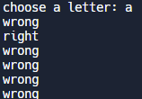

## 7일차 - 종합 활용

## Hangman 게임 만들기

#### Step1

영단어와 철자 일치여부 확인 코드

-  제시

  ```
  #Step 1 
  import random
  word_list = ["aardvark", "baboon", "camel"]

  #TODO-1 - Randomly choose a word from the word_list and assign it to a variable called chosen_word.
  #TODO-2 - Ask the user to guess a letter and assign their answer to a variable called guess. Make guess lowercase.
  #TODO-3 - Check if the letter the user guessed (guess) is one of the letters in the chosen_word.
  ```

  ​

- 내 코드

  ```
  #1
  chosen_word = random.choice(word_list)
  #2
  guess = input("choose a letter: ").lower()
  #3
  if guess in chosen_word:
     print("right")
  else : 
     print("wrong")
  ```

  ​

- 강사 코드

  ```
  #1
  chosen_word = random.choice(word_list)
  #2
  guess = input("choose a letter: ").lower()

  #3
  for letter in chosen_word:
    if letter ==guess:
      print("right")
    else:
      print("wrong")
  ```

  

### Step2

영단어와 철자 일치 시 코드에 작성

- 내 코드

  ```
  guess = input("Guess a letter: ").lower()

  display=[]
  for letter in range(len(chosen_word)):
    display.append('_')
    
  for position in range(len(chosen_word)):
      letter = chosen_word[position]
      if letter == guess:
        display[position]=letter
  ```

  ​

### Step3

영단어 맞출때까지 철자 입력 코드

- 내 코드

  ```
  while "_" in display:
      guess = input("Guess a letter: ").lower()

      #Check guessed letter
      for position in range(word_length):
          letter = chosen_word[position]
          #print(f"Current position: {position}\n Current letter: {letter}\n Guessed letter: {guess}")
          if letter == guess:
              display[position] = letter

      print(display)
  print("너가 이겼다.")
  ```

  ​

- 강사 코드

  ```
  end_of_game = False
  while not end_of_game:
      guess = input("Guess a letter: ").lower()

      #Check guessed letter
      for position in range(word_length):
          letter = chosen_word[position]
          if letter == guess:
              display[position] = letter

      print(display)
      if "_" not in display:
          end_of_game = True
          print("너가 이겼어")
  ```

  - 개선해야 할 점
    - 추가 작업을 위해 직접적인 while "_" in display: 도 좋지만 end_of_game 이라는 초기값을 설정하여 반복문 종료시 활용하는 점이 더욱 효과적이다.(**Flag 변수 활용**)

### Step4

철자 불일치 시 목숨 차감 

- 강사 코드

  ```
  display = []
  for _ in range(word_length):
      display += "_"

  while not end_of_game:
      guess = input("Guess a letter: ").lower()

      for position in range(word_length):
          letter = chosen_word[position]
          if letter == guess:
              display[position] = letter

      if guess not in chosen_word:
          lives -= 1
          if lives == 0:
              end_of_game = True
              print("You lose.")

      print(f"{' '.join(display)}")

      if "_" not in display:
          end_of_game = True
          print("You win.")

      print(stages[lives])
  ```

  ​

### Step5

- 모듈확용하여 확장하기


### FInal Code

- 개선 필요 종목

  - 모듈 import

  - 글자 수 만큼 ["_","_","_","_","_",]  작성 시 여러방법중에 len을 활용하여 다음 코드도 고려하기

  - 인덱스를 통한 몇번째 철자 수정하기

    ```
    for position in range(word_length):
          letter = chosen_word[position]
    ```

==> **hangman_project.py** 로 작성