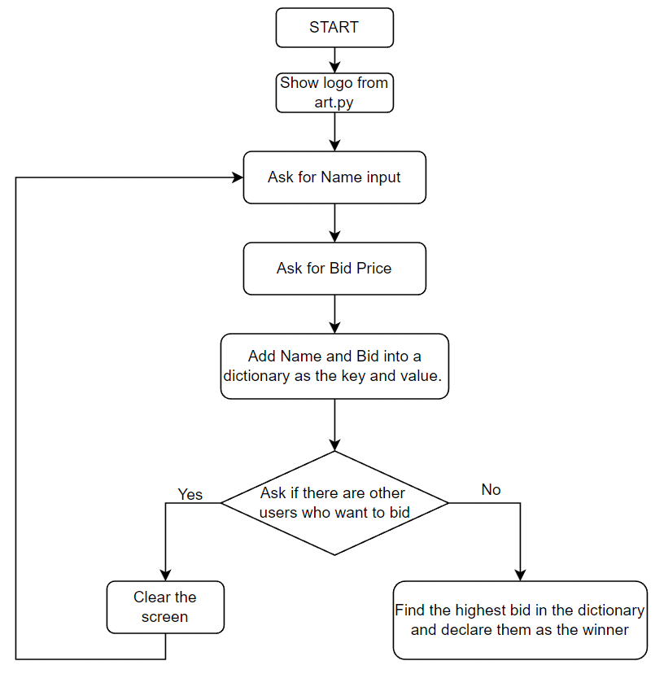

## 9일차 - Dictionary

## 등급 매기는 프로그램

- 제시

  ```
  student_scores = {
      "Harry": 81,
      "Ron": 78,
      "Hermione": 99,
      "Draco": 74,
      "Neville": 62,
  student_grades = {}
  ```

  ​

- 내 코드

  ```
  for key in student_scores:
      score = student_scores[key]
      if score >= 91 and score < 100:
          print("Outstanding")
  print(student_grades)
  ```

  ​

- 강사 코드

  ```
  for key in student_scores:
      score = student_scores[key]
      if score > 90:
          student_grades[key] = "Outstanding"
  ```

  - 개선해야 할 점
    - 할당에 대한 인식 부족으로 오류


## 리스트와 딕셔너리 중첩하기

- 내 코드

  ```
  travel_log = [
  {
    "country": "France",
    "visits": 12,
    "cities": ["Paris", "Lille", "Dijon"]
  },
  {
    "country": "Germany",
    "visits": 5,
    "cities": ["Berlin", "Hamburg", "Stuttgart"]
  },
  ]


  def add_new_country(country_visited,times_visited, cities_visited):
  	new_country={}
  	new_country['country']= country_visited
  	new_country['visits'] = times_visited
  	new_country['cities']= cities_visited
  	travel_log.append(new_country)
  	# append()는 딕셔너리가 아니라 리스트 항목을 추가 할 때만 사용 가능
  	

  add_new_country("Russia", 2, ["Moscow", "Saint Petersburg"])
  print(travel_log)
  ```

- ​


## 경매 프로그램

- 코드

  ```
  from replit import clear
  #HINT: You can call clear() to clear the output in the console.

  # from art import logo
  # print(logo)
  price_list={}

  # flag 변수
  bidding_finished=False # 기본값


  # 가장 높은 가격 알려주는 함수 작성
  def find_highest_bidder(bidding_reocord):
      highest_bid=0
      winner=''
      for bidder in bidding_reocord:
          bid_amount=bidding_reocord[bidder]
          if bid_amount > highest_bid:
              highest_bid = bid_amount    
              winner=bidder
      print(f'낙찰된 사람은 {winner}이고 가격은${highest_bid}')

  # 이름과 입찰가 반복
  while not bidding_finished:
      name=input("What is your name?: ")
      price=int(input("What is your bid?: $"))
      # 딕셔너리에 항목을 추가하기 위해 key:name, value:price
      price_list[name]=price
      should_continue = input("Are there any other bidders? Type 'yes or 'no'.\n") 
      if should_continue == "no":
          bidding_finished=True # while 반복문 종료
          find_highest_bidder(price_list)
      elif should_continue == "yes":
          clear()
  ```

  

  ​

  - 개선해야 할 점
    - 처음부터 쭉 작성하기는 힘들며 설계도가 중요하다.

    - 딕셔너리 형태로 코드 작성이 어려움

      ```
      price_list[name]=price # 딕셔너리에 항목을 추가하기 위해 key:name, value:price
      ```

    - 함수 만들어서 적용하기

      ```
      find_highest_bidder(price_list)
      ```

      ​